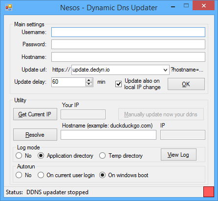

# DynamicDnsUpdater
***Allows you to keep updated the Dynamic DNS easily***  
  
## How to use and configure:  
1.  Download the program under [Compiled Binary/DynamicDnsUpdater.exe](Compiled Binary/DynamicDnsUpdater.exe)  
2. Optional but suggested: Check the digital signature using [my public key](Documentation/Nesos code signing public key.asc). (You can find more informations about digital signatures and why they are important [here](https://www.qubes-os.org/doc/verifying-signatures/))  
3. Open and follow on screen instructions  (fill data and click ok)

##For [deSEC](https://desec.io/#!/en/) users:  
- username field: fill with your hostname (example: something.dedyn.io)  
- password field: fill with your password (you should have received it by email)  
- hostname field: fill with your hostname (same as username field)  
- update url: is yet correct, no need to edit  
- delay: i think that every 60 minutes is a good option (delay between 1 min - 24 hours)  

Click OK to confirm and that is all what you need to do!
## Documentation
If for some reason you don't have .NET framework 3.0 you should be able to download it from here: [.NET 3.0 (64bit)](http://go.microsoft.com/fwlink/?LinkId=98106) -
[.NET 3.0 (32bit)](http://download.microsoft.com/download/8/F/E/8FEEE89D-9E4F-4BA3-993E-0FFEA8E21E1B/NetFx30SP1_x86.exe)  

If there is an error different from a connection problem, for example: wrong pasword, the updater will stop (red square); Check if settings are correct.  
If something doesn't work try to enable and view the log, it has useful informations inside; you can also set the log option from commandline.  

Let me know if you find any bug by reporting them  
Also report feature requests  

For more complete and detailed informations check:  
**[FAQ](Documentation/FAQ.md)**  
**[Security FAQ](Documentation/Security FAQ.md)**  
**[File format specifications](Documentation/File format specifications.md)**  
**[Version history](Documentation/Version history.md)**  